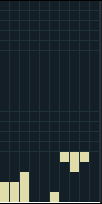

<!-- PROJECT LOGO -->
 

  
  <h1 align="center">Tetris</h1>

  

  

## How to start

- You can copy the contents of each file and paste them into a new file with the same name (you can also do [this](https://stackoverflow.com/questions/7106012/download-a-single-folder-or-directory-from-a-github-repo) )
- you can watch this video [ [Link](https://drive.google.com/file/d/1R2_uAgNCkhFO7U0anQJ5Yvw_o3MVDZqz/view?usp=sharing) ]
- about **venv** (virtual enviernment) [ [Link](https://packaging.python.org/en/latest/guides/installing-using-pip-and-virtual-environments/) ]
